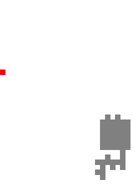

# wrappers-delight

> I said a bit wrap
>
> Lambda to the lambda
> 
> The bit, bit a wrap, and you don't stop, ICFP 2019



## setup

```bash
brew install pipenv
pipenv install --dev
pipenv shell
python main.py
```
